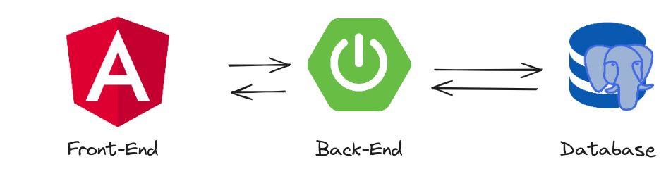

# My Bussiness

An application that helps small business companies to control their sales and orders.

## Tech Stack

## :arrow_down: Denpendencies

| Technology  | Version |
| ----------- | ------: |
| Node        |  20.9.0 |
| Angular     |  17.0.1 |
| Java        |  21.0.1 |
| Spring Boot |   3.1.5 |

## Developing environment

It's recommended to have [**_Docker_**](https://www.docker.com/) installed in your local environment to help you with the application development.

## myBusinessApp

Is the application front-end, developed with [**_Angular_**](https://angular.dev/) framework.

## myBusinessServer

Is the application back-end, developed with [**_Spring boot_**](https://spring.io/) framework.
